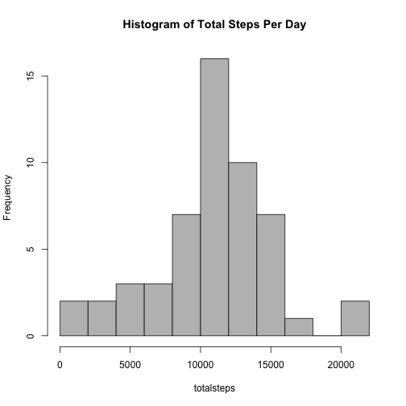
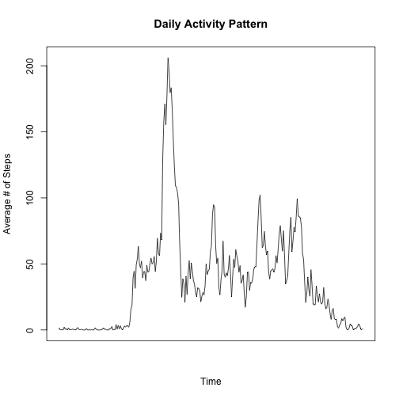
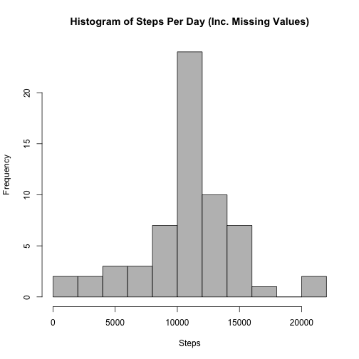
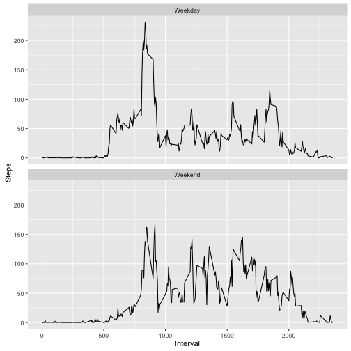

# Load data.


```r
activity <- read.csv("activity.csv")
```

# Calculate mean total number of steps taken per day.


```r
totalsteps <- tapply(X = activity$steps, INDEX = activity$date, FUN = sum)
hist(totalsteps, breaks=10, main="Histogram of Total Steps Per Day", col="gray")
```



#Calculate average daily activity pattern.


```r
intervalsteps <- tapply(X = activity$steps, INDEX = activity$interval, 
                         FUN = mean, na.rm = T)
plot(intervalsteps, type="l", xaxt="n",
     main="Daily Activity Pattern", 
     xlab="Time", ylab="Average # of Steps")
```



```r
intervalsteps[which(intervalsteps == max(intervalsteps))]
```

```
##      835 
## 206.1698
```

#Assess missing values


```r
sum(is.na(activity$steps))
```

```
## [1] 2304
```

```r
activity2 <- activity
for (i in 1:nrow(activity2)){
  if (is.na(activity2[i, 1])){
    int_nr <- activity2[i, "interval"]
    
  replacement <- intervalsteps[names(intervalsteps) == int_nr]
  replacement <- round(replacement)
  activity2[i, 1] <- replacement
  }
}
```

# Show some rows of the resuting data frame. Previously were NA --


```r
activity2[109:120,]
```

```
##     steps       date interval
## 109   143 2012-10-01      900
## 110   124 2012-10-01      905
## 111   109 2012-10-01      910
## 112   108 2012-10-01      915
## 113   104 2012-10-01      920
## 114    96 2012-10-01      925
## 115    66 2012-10-01      930
## 116    45 2012-10-01      935
## 117    25 2012-10-01      940
## 118    39 2012-10-01      945
## 119    35 2012-10-01      950
## 120    21 2012-10-01      955
```

# Check deltas between the files.


```r
hist(aggregate(steps ~ date, FUN=sum, data=activity2)$steps, breaks=10,
     main="Histogram of Steps Per Day (Inc. Missing Values)", col = "gray",
     xlab = "Steps")
```



# Deltas in activity patterns with weekends vs. weekdays


```r
week <- rep(NA, times = nrow(activity2))
for (i in 1:nrow(activity2)){
  day <- as.POSIXlt(activity2[i, "date"])$wday
  # 0 means sunday, 6 means saturday
  if (day == 0 | day == 6) week[i] <- "Weekend"
  else week[i] <- "Weekday"
}
week <- factor(week) # convert to factor
activity2 <- cbind(activity2, week) # merge
str(activity2)
```

```
## 'data.frame':	17568 obs. of  4 variables:
##  $ steps   : num  2 0 0 0 0 2 1 1 0 1 ...
##  $ date    : Factor w/ 61 levels "2012-10-01","2012-10-02",..: 1 1 1 1 1 1 1 1 1 1 ...
##  $ interval: int  0 5 10 15 20 25 30 35 40 45 ...
##  $ week    : Factor w/ 2 levels "Weekday","Weekend": 1 1 1 1 1 1 1 1 1 1 ...
```

# Plot data.


```r
library(reshape2)
library(ggplot2)
plotdata <- with(activity2, tapply(steps, INDEX = list(interval, week), mean))
plotdata <- melt(plotdata, id=c("Weekday", "Weekend"),
                 varnames = c("Interval", "Week"), value.name = "Steps")
head(plotdata)
```

```
##   Interval    Week      Steps
## 1        0 Weekday 2.28888889
## 2        5 Weekday 0.40000000
## 3       10 Weekday 0.15555556
## 4       15 Weekday 0.17777778
## 5       20 Weekday 0.08888889
## 6       25 Weekday 1.57777778
```

```r
ggplot(plotdata, aes(Interval, Steps)) + geom_line() + facet_wrap(~Week, nrow=2)
```


